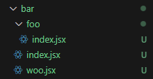

# _202030215 서민석_

## _10월 4일_

### *_app*
```
app.jsx는 서버에 요청할 때 가장 먼저 실행되는 컴포넌트
```
* **페이지에 적용할 공통 레이아웃을 선언하는 곳**
* **Global CSS는 이곳에 추가 됨.**
* **props 중 Component는 서버에 요청한 페이지임.**
* **pageProps는 App.getInitalProps를 이용하여 prefetching된 데이터를 변환 함.**
* **데이터가 없다면 빈 객체({})를 반환**
* **단 getStaticProps, getServerSideProps와 같은 Data Fetching methods는 동작하지 않음.**

### *_document*

```
document.jsx는 _app.jsx 다음에 실행됨
```
* **각 페이지에서 공통적으로 사용될 html, head, body 안에 들어갈 내용을 선언함.**
* **onClick 같은 이벤트나 CSS는 이 곳에 선언하지 않음.**
* **로직(이벤트), 스타일을 선언할 수 없음.**

### *layout.jsx*
```
layout.jsx는 app 디렉토리 아래에 위치함.
```
* **layout.jsx는 Page Project에서 사용하던 _app.jsx와 _document.jsx를 대체함.**
* **이 파일은 삭제해도 프로젝트를 실행하면 자동으로 생성 됨.**

## _10월 2일_


* *bar/woo Page - bar 디렉토리 루트*
  * **라우팅을 하려는 페이지는 같은 이름이 들어가면 안됨**
  * **ex) localhost:3000/bar/foo/index.jsx를 주소창에 입력 시 404 오류 발생**

```
Page Routing
1. App routing (Y/N) N
2. src / ? 안 쓰는게 나음
```

## _9월 25일_

### *라우팅 시스템*
* 특징
  * *React의 React Router, Reach Router 등은 클라이언트 라우팅만 구현할 수 있음.*
  * *Next는 파일 시스템 기반 페이지와 라우팅을 함.*
  * *페이지는 /pages 디렉토리 안의 *.js, *.jsx, *.ts, *.tsx 파일에서 export한 React 컴포넌트 임.*
```js
function HomePage() {
  return <div> This is the HomePage. </div>
}

export default Homepage;
```
### *페이지에서 경로 매개변수 사용*
```js
export async function getServerSideProps({params}){
  const {name} = params
  return {
    props: {
      name,
    },
  };
}

function Greet(props) {
  return (
    <h1>Hello, {props.name}! </h1>
  );
}
export default Greet;
```
#### *경로 매개변수를 사용해서 동적 페이지를 쉽게 만들 수 있음.*
* *내장 getServerSideProps 함수를 통해 URL에서 동적으로 [name] 변수 값을 가져오는 것*
* *greet/Mitch 주소로 가면 "Hello, Mitch!" 라는 문구가 렌더링 됨.*
## _9월 11일_

### _파이프 라인_

```
코드를 빌드, 테스트, 배포하는 과정을 거쳐 소프트웨어 개발을 추진하는 프로세스
```

#### 파이프라인은 공식적으로 채택되지 않은 연산자임.

- **사용법**
  - **바벨 플러그인** 설치
  - **.babelrc** 파일 수정
- **Babel**

```
ECMAScript와 같은 자바스크립트 최신 버전이나,
TypeScript를 이전 버전의 코드로 변환시켜주는 Transpile 도구임.
```

- Babel의 단점
  - Babel로 변환된 코드를 이해하기 어려움.
  - 원 코드에 비해 변환 코드의 길이가 늘어남.
  - 변환에 시간이 많이 걸림
- SWC 장점

  - Next 12 이후 별도의 설정 없이 SWC를 사용할 수 있음. Next.js에 내장되어 있음.
  - Rust의 WASM(WebAssembly) 지원으로 어떤 종류의 플랫폼에서도 Next JS 개발을 할 수 있음.
  - 변환 시간이 빠름.
  - 커뮤니티가 빠르게 성장하고 있어 도움 받기가 쉬움.

- **Transpile은 어떻게 동작하나**
  - **개발자가 작성한 코드 -> Parse -> Transform -> Generate -> 이전 버전의 코드**
  - **Babel의 parser는 자바스크립트를 컴퓨터가 이해할 수 있는 코드구조인 Abstract Syntax Tree(AST)로 변환해 주는 역할을 수행함.**
  - **Babel의 traverse 모듈은 전체 트리 상태(AST)를 유지하여 노드 교체, 제거, 추가를 담당함.**
  - **generator가 수정된 AST를 일반 코드로 변환해 주게 됨.**

### _렌더링 전략_

```
렌더링 전략이랑 웹 페이지 또는 웹 애플리케이션을 웹 브라우저에 제공하는 방법을 의미
```

- **Next.js를 사용할 시에 가져오는 이점**
  - **어떤 페이지는 빌드 시점에 정적으로 생성하고 어떤 페이지는 실행 시점에 동적으로 생성할지 쉽게 정할 수 있음.**
  - **또한 특정 페이지에 대한 요청이 있을 때마다 페이지를 다시 생성할 수도 있음.**
  - **그리고 반드시 클라이언트에서 렌더링해야 할 컴포넌트도 지정할 수 있어서 개발이 쉬움.**

### _서버 사이드 렌더링(SSR)_

- **웹 페이지를 제공하는 가장 흔한 방법임.**
- **APM을 이용하는 일반적인 웹 페이지 생성**
- **자바스크립트 코드가 적재되면 동적으로 페이지 내용을 렌더링함.**

  - **여기에 스크립트 코드를 집어 넣어서 나중에 웹 페이지를 동적으로 처리할 수도 있는데 이를 하이드레이션이라고 함.**

- **SSR의 장점**
  - **더 안전한 웹 애플리케이션 : 쿠키 관리, 주요 API, 데이터 검증 등과 같은 작업을 서버에서 처리하기에 중요한 데이터를 클라이언트에 노출할 필요가 없기 때문임.**
  - **더 뛰어난 웹 사이트 호환성 : 클라이언트 환경이 자바스크립트를 사용하지 못하거나 오래된 브라우저를 사용하더라도 서비스를 제공할 수 있음.**
  - **더 뛰어난 SEO : 서버가 렌더링한 HTML을 받기 때문에 봇이나 웹 크롤러가 페이지를 렌더링할 필요가 없기 때문임.**
- **SSR이 최적의 렌더링 전략이 아닌 경우**
  - **클라이언트가 페이지를 요청할 때마다 페이지를 다시 렌더링할 수 있는 서버가 필요**
  - **다른 방식에 비해 SSR이 더 많은 자원을 소모하고, 더 많은 부하를 보이며 유지 보수 비용도 증가함.**
  - **페이지에 대한 요청을 처리하는 시간이 길어짐.**
  - **페이지가 외부 API 또는 데이터 소스에 접근해야 한다면 해당 페이지를 렌더링할 때마다 이를 다시 요청해야 함.**
  - **페이지 간의 이동은 CSR에 비해 느림.**

### _클라이언트 사이드 렌더링(CSR)_

- **React 앱을 실행하면 렌더링 시작 전에 빈 화면이 한동안 유지 되는 것이 보임.**
- **이는 서버에서 스크립트와 스타일만 포함된 HTML을 전송하기 때문임.**
- **실제 렌더링은 클라이언트에서 이루어짐**
- **CSR로 생성한 앱의 HTML을 보면 div태그 하나 밖에 없음. 그래서 빈 화면만 보였던 것**
- **빌드 과정에서 js와 css파일을 HTML페이지에 불러오도록 만들고 root div에 렌더링 함.**

#### CSR 장단/점

- **CSR 사용 이점**
  - **네이티브 앱처럼 느껴지는 웹 앱**
    - **전체 자바스크립트 번들을 다운로드 한다는 것은 렌더링 할 모든 페이지가 이미 브라우저에 다운로드 되어 있다는 뜻**
    - **다른 페이지로 이동해도 서버에 요청할 필요가 없이 바로 페이지로 이동할 수 있음.**
    - **페이지를 바꾸기 위해 새로 고칠 필요가 없음.**
  - **쉬운 페이지 전환**
    - **클라이언트에서의 내비게이션은 브라우저 화면을 새로 고칠 필요 없이 다른 페이지로의 이동을 가능하게 만듬**
    - **페이지 간 전환에 멋진 효과를 넣을 수도 있음. 애니메이션을 방해할 요소가 없기 때문임.**
  - **서버 부하 감소**
    - **서버리스 환경에서 웹 앱을 제공할 수도 있음.**
- **CSR 사용 단점**
  - **네트워크 속도가 느린 환경에서는 번들이 모두 다운로드 될 때까지 계속 빈 페이지를 봐야함.**
  - **검색 로봇에게도 그 내용은 빈 것으로 보임.**
  - **번들을 모두 받을 때까지 검색 로봇이 기다리기는 하지만 성능 점수는 낮을 것**

### _정적 사이트 생성_

```
SSG는 일부 또는 전체 페이지를 빌드 시점에 미리 렌더링 함
SSG는 SSR 및 CSR과 비교했을 때 다음과 같은 장점이 있음.
```

- **장점**
  - **쉬운 확장**
    - **정적 페이지는 단순 HTML 파일이기에 CDN을 통해 파일을 제공하거나 캐시에 저장하기 쉬움**
  - **뛰어난 성능**
    - **빌드 시점에 HTML 페이지를 미리 렌더링하기 때문에 페이지를 요청해도 클라이언트나 서버가 무언가를 처리할 필요가 없음.**
  - **더 안전한 API 요청**
    - **외부 API를 호출하거나, 데이터베이스에 접근하거나, 보호해야 할 데이터에 접근할 일이 없음.**
    - **필요한 모든 정보가 빌드 시점에 미리 페이지로 렌더링 되어 있기 때문.**

## _8월 28일_

### _Next.js_

```
Next.js는 리액트를 위해 만든 오픈소스 자바스크립트 웹 프레임워크임.
```

- **Next.js 특징**

  - **리액트에는 없는 다양한 기능을 제공함.**
  - **서버 사이드 렌더링**
  - **정적 사이트 생성**
  - **증분 정적 재생성**

- **Next.js와 비슷한 프레임워크**

  - **Gastby**
  - **Razzle**
  - **Nuxt.js**
  - **Angular Universal**

### _증분 정적 재생성_

```
정적 페이지 생성(SSG)은 미리 만들어 놓은 페이지를 서비스 하기 때문에 속도는 빠르지만,
한번 생성하고 나면 수정이 불가능함. 이러한 단점을 보완하고자 나온 것이 증분 정적 재생성
(ISR)임. 이미 생성된 페이지를 일정 시간이 지난 후에 다시 생성함.
```

### _Next.js가 제공하는 새로운 기능들_

- **코드 분할 : 페이지를 로딩 할 때 번들을 여러 조각으로 나눠 필요한 부분만 전송**
- **파일 기반 라우팅**
- **경로 기반 프리페칭 : 사용자가 다음에 이동할 수 있는 페이지를 미리 가져오는 기술.**
- **서버 사이드 렌더링(SSR) : 페이지 요청이 올 때마다 사전 렌더링**
- **정적 사이트 생성(SSG) : 빌드하는 동안 페이지를 사전 생성**
- **증분 정적 콘텐츠 생성(ISR) : 배포 후에도 재배포 없이 계속 업데이트.**
- **타입스크립트 기본 지원**
- **자동 폴리필 적용 : 이전 브라우저에서 최신 기능을 제공하는 데 필요한 코드를 제공**
- **이미지 최적화 : Next/image 컴포넌트로 제공하는 이미지의 최적화 기술**
- **웹 애플리케이션의 국제화 지원 : 다국어 지원**
